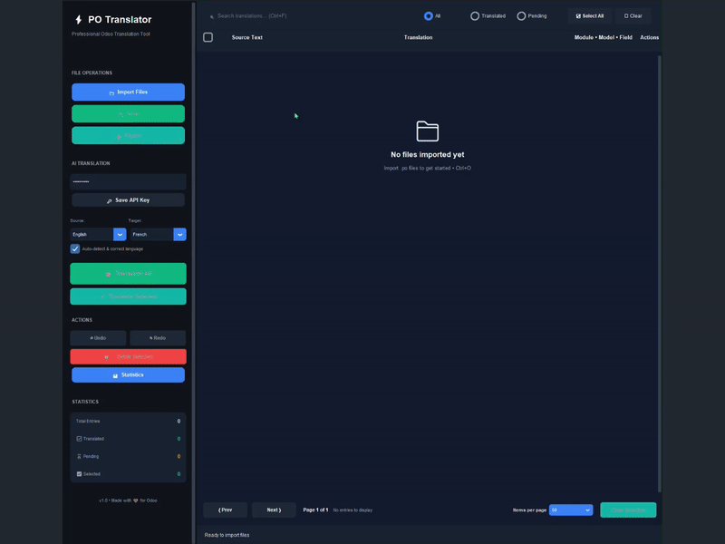
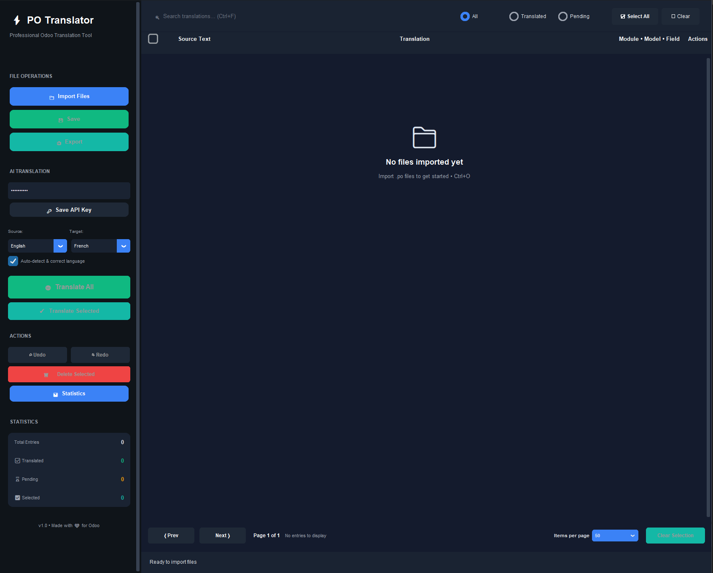
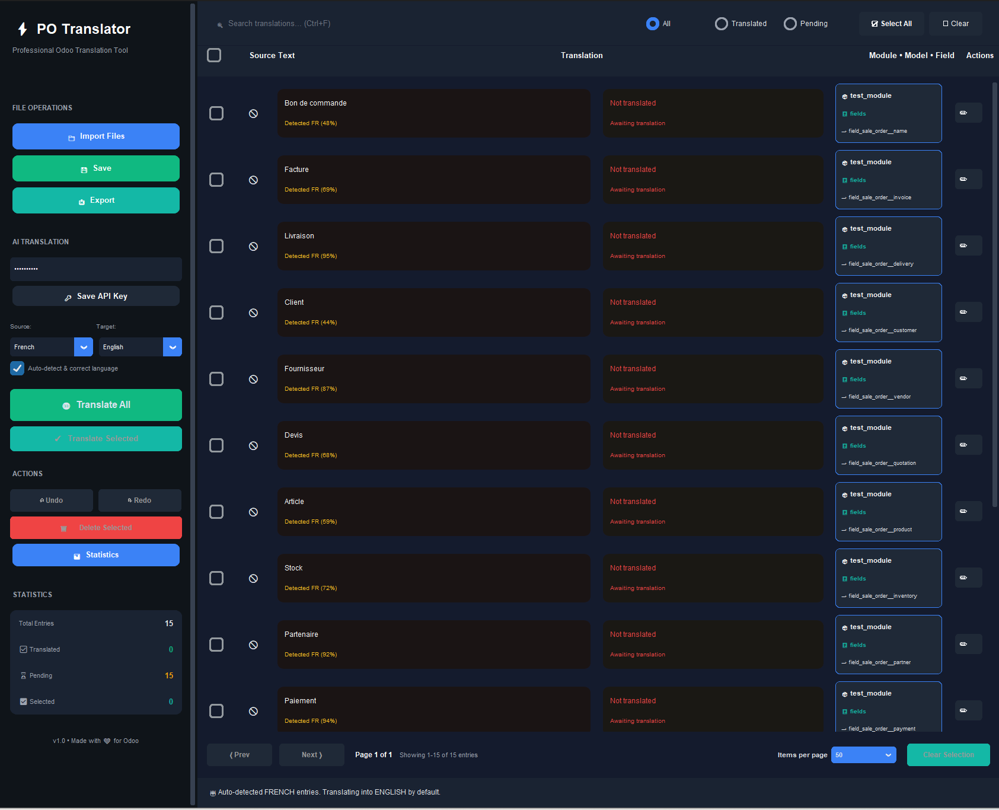
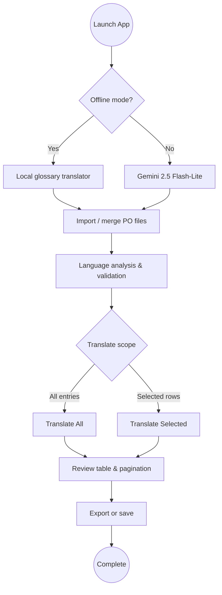

# Odoo PO Translator


[](https://www.python.org/downloads/)
[](LICENSE)
[](CHANGELOG.md)

> **AI-powered translation assistant for Odoo `.po` files with offline support**

Fast, intelligent tool for translating Odoo localization files. Works online with Gemini AI or completely offline with built-in glossaries. Features smart language detection, variable preservation, and Odoo-specific terminology database. Includes modern GUI and CLI for automation.

**Why this tool?** Manual translation of Odoo modules is slow and error-prone. This tool automates the process while preserving technical placeholders and using consistent ERP terminology across 8 current languages.


## Screenshots & Demo

### 🎥 Video Demo - Complete Workflow



*Demo showing: Import PO file → Auto language detection → AI translation*

> 💡 **Tip:** [Click here to watch the full-quality video (MP4)](https://github.com/K11E3R/odoo_translator/raw/main/docs/screenshots/odoo_translator_import_flow.mp4)

---

### Main Interface - Premium Dark Theme

*Clean, modern dark theme with professional sidebar navigation and empty state*

### Translation Workflow in Action

*Real-world example: 15 French entries with accuracy percent on language detection, module/model/field information, and translation status badges*

**Key features visible:**
- 🎯 **Language Detection**: "Detected FR (48%)" badges with adaptive confidence
- 📦 **Module Info**: Complete module, model (fields), and field path for each entry
- 🔄 **Translation Status**: "Not translated" / "Awaiting translation" indicators
- 🎨 **Premium UI**: Deep navy backgrounds, vibrant accents, crystal-clear typography

---

## Quick start

```bash
pip install -r requirements.txt
python app.py              # launch the desktop app
# or
po-translator translate module.po --target fr --offline
```

---

## Key features (v1.0.0)

- **Gemini 2.5 Flash-Lite** support with rate-limited requests and cache reuse when an API key is provided
- **Offline glossary engine** (English↔French, English↔Spanish) that keeps placeholders intact for air-gapped use
- **Smart language detection** combining heuristics, `langid`, and Google Translate (optional) to flag mismatches before translating
- **CustomTkinter UI** with pagination, selection tools, theming, and language-mismatch prompts tuned for Odoo strings
- **Simple CLI** (`po-translator`) that mirrors GUI rules for unattended runs, including dry-run validation

---

## Working offline

- Set `PO_TRANSLATOR_OFFLINE_MODE=1` or toggle "Offline mode" in the sidebar to stay on local translations only
- Disable network-backed detection by exporting `PO_TRANSLATOR_USE_GOOGLE_DETECTION=0`
- Cached results live in `~/.po_translator` so repeated phrases stay instant even without the network

---

## Important limitations

- Automated translations are drafts — review output for domain-specific vocabulary and legal terminology
- Offline glossary coverage is intentionally narrow; uncommon language pairs fall back to the online model when available
- Google Gemini or Translate APIs may change pricing or availability. Monitor usage and keep keys outside the repository
- The GUI targets desktop workflows; server-side Odoo integration and headless automation are not bundled
- No telemetry or analytics are collected, but logs and caches remain on disk. Clear them with `python clear_cache.py` if needed

---

## Project status & support

- Current release: **v1.0.0** (MIT licensed)
- Tested on Python 3.11+ using `python -m unittest` with offline mode enabled
- Security guidance and supported versions live in [SECURITY.md](SECURITY.md); lifecycle notes are kept in [CHANGELOG.md](CHANGELOG.md)

---

## Requirements

- **Python 3.11+**
- **Gemini API Key** (free at https://aistudio.google.com/app/apikey) — optional when using offline mode
- **Dependencies**: `polib`, `langdetect`, `langid`, `customtkinter`, `google-generativeai`, `googletrans`

**WSL Users**: `sudo apt install python3-tk`

---

## Usage

### 1. Get API Key (Optional)

1. Visit https://aistudio.google.com/app/apikey
2. Create a free API key
3. Paste it in the app sidebar and click "Save API Key"

### 2. Import PO Files

- Click "📁 Import Files"
- Select one or more `.po` files
- Files are automatically merged and deduplicated

### 3. Configure Languages

- **Source Language**: Language of `msgid` (default: English)
- **Target Language**: Language for `msgstr` (default: French)
- **Auto-detect**: Automatically correct language mismatches

### 4. Translate

- Click "🌐 Translate All" to translate all untranslated entries
- Or select specific entries and click "✓ Translate Selected"
- Enable **Offline mode** in the sidebar to use the local glossary translator instead of Gemini
- Prefer the `po-translator` CLI for automated builds and CI pipelines (see [Command Line Usage](#command-line-usage))

### 5. Export

- Click "💾 Save File" to export translated `.po` file
- Optionally compile to `.mo` file

---

## Command Line Usage

Use the bundled CLI when you need unattended translations:

```bash
# Translate a PO file offline and overwrite it in place
po-translator translate --source fr --target en --offline --in-place test_files/test_fr_en.po

# Keep the original file intact and write to ./build with a suffix
po-translator translate test.po --output-dir build --suffix .en --target en

# Force retranslation using Gemini if an API key is available
GEMINI_API_KEY=... po-translator translate module.po --source en --target fr

# Dry run (validation only)
po-translator translate module.po --target es --dry-run
```

The CLI mirrors the GUI rules (language detection, glossary handling, cache reuse). Use `--dry-run` to validate files without touching disk and `--include-obsolete` when auditing archived entries.

---

## Modes & Workflow



---

## Offline Mode

- Toggle directly from the sidebar ("Offline mode (no API)") or set `PO_TRANSLATOR_OFFLINE_MODE=1` before launching the app
- Works entirely without network access using curated Odoo terminology for English↔French and English↔Spanish flows
- Offline translations participate in caching, statistics, selection workflows, and validation prompts
- Supply a Gemini API key and disable offline mode to switch back to high-fidelity online translations

---

## Project Structure

```
translator_odoo/
├── app.py                      # Main entry point
├── clear_cache.py              # Cache management utility
├── requirements.txt            # Python dependencies
├── test_translation_debug.py   # Debug translation issues
├── test_translator.py          # Unit tests
├── test_files/                 # Sample PO files for testing
│   ├── test_fr_en.po          # French → English test
│   ├── test_mixed.po          # Mixed language test
│   └── test_with_variables.po # Variable preservation test
└── src/po_translator/
    ├── translator.py           # Core AI translator (Gemini 2.5)
    ├── cli.py                  # Command-line interface
    ├── core/                   # Business logic
    │   ├── merger.py          # PO file merging
    │   ├── cleaner.py         # Entry deduplication
    │   └── indexer.py         # Module tracking
    ├── utils/                  # Utilities
    │   ├── logger.py          # Logging system
    │   ├── language.py        # Language detection
    │   └── file_utils.py      # File operations
    └── gui/                    # GUI components
        ├── app.py             # Main application window
        ├── components/        # UI components
        │   ├── sidebar.py     # Scrollable left sidebar
        │   ├── toolbar.py     # Top toolbar
        │   ├── table.py       # Translation table
        │   └── statusbar.py   # Bottom status bar
        ├── dialogs/           # Dialog windows
        │   ├── edit_dialog.py
        │   ├── export_dialog.py
        │   └── statistics_dialog.py
        └── widgets/           # Custom widgets
            └── undo_manager.py
```

---

## Core Components

### Translator (`src/po_translator/translator.py`)

**Key Features:**
- Gemini 2.5 Flash-Lite integration
- Smart language detection with keyword-based fallback
- Odoo glossary for consistent terminology
- Translation caching (JSON-based)
- Variable preservation validation
- Retry logic with rate limiting (~10 req/sec)
- Offline glossary engine for air-gapped environments

**Supported Languages:**
- English (en)
- French (fr)
- Spanish (es)
- German (de)
- Italian (it)
- Portuguese (pt)
- Dutch (nl)
- Arabic (ar)

**Odoo Glossary (French Example):**
```python
"Invoice" → "Facture"
"Quotation" → "Devis"
"Sales" → "Ventes"
"Purchase Order" → "Bon de commande"
"Delivery Order" → "Livraison"
"Partner" → "Partenaire"
"Customer" → "Client"
"Vendor" → "Fournisseur"
# ... and more
```

### Language Detection (`src/po_translator/utils/language.py`)

- **Keyword-based detection** for short texts (< 3 words)
- **langid fallback** for longer texts
- **Confidence mapping** to handle misdetections
- **French/English indicators** for Odoo-specific terms
- **Optional Google-backed detection** (set `PO_TRANSLATOR_USE_GOOGLE_DETECTION=0` to keep detection fully offline)

### Offline Glossary Translator

- Local heuristic engine for common ERP phrases (English ↔ French, English ↔ Spanish)
- Preserves placeholders (`%(name)s`, `%s`, `{x}`) and punctuation automatically
- Caches results alongside online translations
- Toggle via the **Offline mode** switch in the UI or `PO_TRANSLATOR_OFFLINE_MODE=1`

---

## How It Works

### Translation Flow

1. **Import** → Load and merge `.po` files
2. **Detect** → Check language of `msgid` using smart detection
3. **Translate** → Call Gemini API with Odoo-aware prompt (or use offline glossary)
4. **Validate** → Check variables are preserved (`%(name)s`, `%s`, `{x}`)
5. **Cache** → Store translation for reuse (70-90% hit rate)
6. **Export** → Save translated `.po` file

### Smart Language Detection

```python
# Example: msgid is French but should be English
msgid = "Facture"  # Detected as French
target = "fr"      # Target is French

# Result: Skip! Already in target language
# OR translate to English first if source language is English
```

The system combines:
- Keyword-based detection for short texts (Odoo-specific terms)
- `langid` for longer phrases
- Optional Google Translate detection for ambiguous cases
- Confidence mapping to handle edge cases

### Prompt Engineering

The AI translator uses carefully crafted prompts to ensure high-quality, Odoo-aware translations:

```
You are an expert translator for Odoo ERP software.

Task: Translate from French to English
Context: Odoo ERP

Rules:
1. Keep placeholders exactly as they are (%(name)s, %s, {x}, etc.)
2. Preserve HTML tags and newlines (\n)
3. Use professional, natural English suitable for business software
4. Only return the translation — no quotes, no explanation, no commentary
5. Do NOT return the same text unless it's a real cognate (e.g., "Email" stays "Email")

Glossary:
{
  "Facture": "Invoice",
  "Devis": "Quotation",
  "Ventes": "Sales",
  "Bon de commande": "Purchase Order",
  "Livraison": "Delivery Order",
  "Partenaire": "Partner",
  "Client": "Customer",
  "Fournisseur": "Vendor"
  ... (full Odoo terminology)
}

Text: Créer une nouvelle facture pour ce client
Translation:
```

**Result**: `Create a new invoice for this customer`

The prompt ensures:
- Variables are never modified
- Odoo-specific terminology is consistent
- Professional tone appropriate for ERP software
- No hallucinations or extra commentary
- Smart handling of cognates and technical terms

---

## GUI Features

### Sidebar (Scrollable)
- API key management
- Language selection (source/target)
- Auto-detect toggle
- Offline mode switch
- Translation controls
- Statistics display

### Translation Table
- Display 50 entries at a time (pagination)
- Inline editing
- Status indicators (translated/untranslated)
- Module tracking
- Search and filter

### Dialogs
- **Edit Dialog**: Modify msgid/msgstr
- **Export Dialog**: Choose export options (.po, .mo)
- **Statistics Dialog**: View detailed stats
- **Language Mismatch Dialog**: Handle detected mismatches

---

## Statistics

View real-time statistics:
- Total requests
- Cache hits (hit rate %)
- API calls (efficiency %)
- Errors and retries
- Auto-corrections
- Cache entries

Click "📊 Statistics" in the sidebar to view.

---

## Configuration

### Environment Variables

```bash
# API key (for automation)
export GEMINI_API_KEY="your-key"

# Offline mode
export PO_TRANSLATOR_OFFLINE_MODE=1

# Disable online language detection
export PO_TRANSLATOR_USE_GOOGLE_DETECTION=0
```

### Files

- `.config` - API key storage (gitignored)
- `~/.po_translator/translation_cache.json` - Translation cache
- `app.log` - Application logs
- `po_translator.log` - Translation logs

### Clear Cache

```bash
python clear_cache.py
```

Or via GUI: Statistics → Clear Cache

---

## Security & Compliance

- Store API keys in environment variables or your CI secret manager. The CLI accepts `--api-key`, but environment variables keep scripts key-free
- Set `PO_TRANSLATOR_USE_GOOGLE_DETECTION=0` and enable offline mode for fully air-gapped usage
- Review [SECURITY.md](SECURITY.md) for supported versions, reporting guidance, and privacy recommendations
- **Do not translate confidential/sensitive data** without compliance review

---

## Releases & Automation

- The project follows semantic versioning—see [CHANGELOG.md](CHANGELOG.md) for release notes
- Install via `pip install .` or `pip install -e .` to obtain the `po-translator` entry point
- Add `python -m unittest` to CI (after setting `PO_TRANSLATOR_OFFLINE_MODE=1`) to keep regressions covered

---

## Development Workflow (Odoo Projects)

```bash
# Navigate to customer project
cdc customer_project

# Launch translator
python ~/path/to/translator_odoo/app.py

# In GUI:
# - Import module's i18n/*.po files
# - Configure source/target languages
# - Translate (online or offline)
# - Export translated file

# Copy translated file back to module
cp translated_output.po ./custom_module/i18n/fr.po

# Update Odoo module
start_odoo -u custom_module
```

---

## Testing

### Debug Translation

```bash
python test_translation_debug.py
```

Tests:
- Basic translation (Facture → Invoice)
- Variable preservation
- Cognate handling (Client, Article)

### Unit Tests

```bash
python test_translator.py
```

### Test Files

Located in `test_files/`:
- `test_fr_en.po` - French to English
- `test_mixed.po` - Mixed languages
- `test_with_variables.po` - Variable preservation

---

## Troubleshooting

| Issue | Solution |
|-------|----------|
| "Module not found" | `pip install -r requirements.txt` |
| "Can't find init.tcl" (WSL) | `sudo apt install python3-tk` |
| Translation not working | Check API key or enable offline mode |
| Slow performance | Clear cache: `python clear_cache.py` |
| Wrong language detected | Enable "Auto-detect" in sidebar |
| Offline mode limitations | Only EN↔FR, EN↔ES supported offline |

**Check logs**: `app.log` (application) and `po_translator.log` (translations)

---

## Performance

- **Rate Limit**: ~10 requests/second (online mode)
- **Cache Hit Rate**: 70-90% on repeated translations
- **Display**: 50 entries/page (configurable)
- **Background Loading**: Non-blocking file import with progress bar
- **Offline**: Instant translation (no network delay)

---

## For Developers

### Adding New Languages

Edit `src/po_translator/translator.py`:

```python
LANGUAGES = {
    "xx": {"name": "New Language"},
}

ODOO_TERMS = {
    "xx": {
        "Invoice": "Translation",
        # ... add terms
    }
}
```

### Customizing Prompt

Edit `_get_prompt()` in `src/po_translator/translator.py`

### Adding GUI Components

1. Create file in `src/po_translator/gui/components/`
2. Import in `__init__.py`
3. Use in `app.py`

### Modifying Language Detection

Edit `src/po_translator/utils/language.py`:
- Add keywords to `FRENCH_INDICATORS` / `ENGLISH_INDICATORS`
- Adjust confidence thresholds
- Add language mappings

---

## Best Practices

1. **Always test** with `test_translation_debug.py` after changes
2. **Clear cache** when changing models or prompts
3. **Use auto-detect** for mixed-language files
4. **Review translations** before deploying to production
5. **Monitor statistics** to track API usage
6. **Keep logs** for debugging (DEBUG level)
7. **Use offline mode** for sensitive data or air-gapped environments

---

## Ideas for Contributors 🤝

We'd love your help! Here are impactful areas where you can contribute:

- Add more language pairs to offline glossary (German, Italian, Portuguese, etc.)
- Create user-managed glossary system (per-project custom terms)
- Improve language detection accuracy for edge cases

- Package as standalone executable (PyInstaller) for non-technical users
- Add API quota monitoring dashboard with usage alerts
- Build Odoo Studio plugin for direct integration
- Create REST API endpoints for CI/CD pipelines

- Implement human-in-the-loop review workflow (approve/reject/comment)
- Add translation quality scoring and confidence metrics
- Create collaborative mode (multi-user translation projects)
- Build dark/light theme switcher

- Support additional AI providers (OpenAI, Claude, Ollama for local LLMs)
- Implement translation memory across projects
- Add batch processing improvements
- Create automated CI testing for multiple Python/Odoo versions

- Add video tutorials and screencasts
- Translate README to other languages
- Create troubleshooting guides
- Write blog posts about Odoo translation best practices

**Pick any task that interests you!** Small contributions are welcome - even fixing typos or improving docs helps. Check open issues or propose new ideas!

---

## Roadmap

- [ ] Expand offline glossaries (more language pairs)
- [ ] User-managed glossaries per project
- [ ] Support OpenAI, Claude, local LLMs (Ollama)
- [ ] Translation memory across projects
- [ ] API quota monitoring in GUI
- [ ] Quality scoring and confidence metrics
- [ ] REST API for CI/CD integration
- [ ] Plugin system for Odoo Studio integration
- [ ] Collaborative translation (multi-user)

---

## Contributing

1. Fork the repository
2. Create a feature branch (`git checkout -b feature/amazing-feature`)
3. Test thoroughly (`python test_translator.py`)
4. Commit changes (`git commit -m '[ADD] feature: description'`)
5. Push to branch (`git push origin feature/amazing-feature`)
6. Open Pull Request

**Code Standards**: Follow existing patterns, add tests, update README

---

## License

**MIT License** - Free to use, modify, and distribute

---

## Pro Tips

💡 **First time?** Start with offline mode and `test_files/test_fr_en.po`  
💡 **Large files?** Use pagination (50 entries/page) + monitor Statistics  
💡 **Mixed languages?** Enable "Auto-detect & correct language"  
💡 **Repeated terms?** Cache will speed up subsequent translations by 70-90%  
💡 **Custom terms?** Add to `ODOO_TERMS` glossary for consistency  
💡 **API limits?** Monitor Statistics → reduce concurrent translations if needed  
💡 **Sensitive data?** Use offline mode (`PO_TRANSLATOR_OFFLINE_MODE=1`)

---

## Support

**Issues?** Check logs first: `app.log` and `po_translator.log`

**Questions?** See [SECURITY.md](SECURITY.md) and [CHANGELOG.md](CHANGELOG.md)

**Need help?** Open a GitHub issue with:
- Error message from logs
- Steps to reproduce
- Python version + OS
- Sample `.po` file (if applicable)

---

